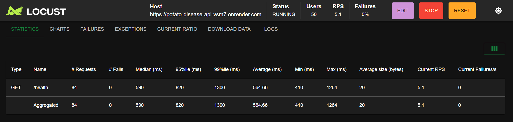

# Potato Disease Detection — MLOps Pipeline

## Project Description
An end-to-end machine learning pipeline for classifying potato 
leaf diseases (Early Blight, Late Blight, Healthy) using the 
PlantVillage dataset. Compares 3 classical ML approaches with 
4 deep learning architectures across 7 systematic experiments.
Best model: MobileNetV2 with 98.8% accuracy.

## Demo Video
[ Demo Video](https://youtu.be/H4UDtIeFruU)

## Deployed App URL
API_URL = "https://potato-disease-api-vsm7.onrender.com"

## GitHub Repository
https://github.com/BirasaDivine/Plant-Disease-Detection-MLOP

## Setup Instructions

### 1. Clone the repository
git clone https://github.com/BirasaDivine/Plant-Disease-Detection-MLOP.git

cd Plant-Disease-Detection-MLOP

### 2. Install dependencies
pip install -r requirements.txt

### 3. Run the API
python -m uvicorn app.main:app --reload

### 4. Run the dashboard (new terminal)
python -m streamlit run app/dashboard.py

### 5. Run with Docker
docker build -t potato-disease 

docker run -p 8000:8000 potato-disease


## Locust Load Test Results

```

